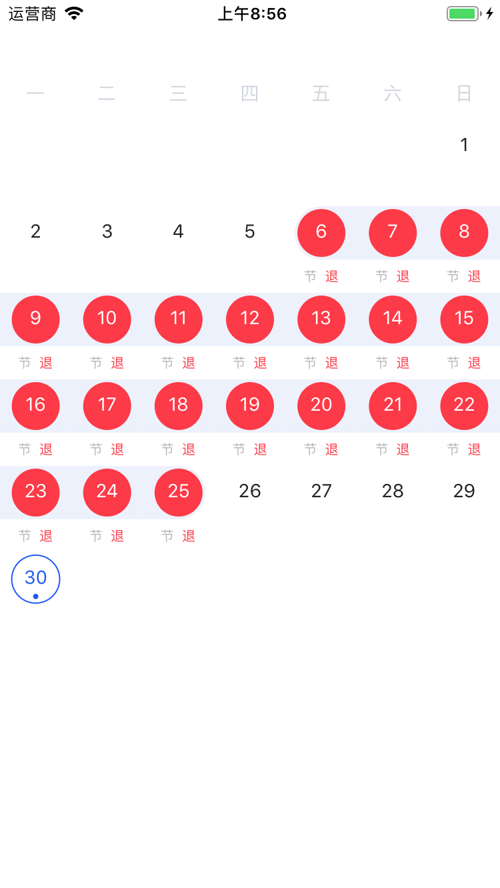

# FSAttendanceTable

[](https://cocoapods.org/pods/FSAttendanceTable)
[](https://cocoapods.org/pods/FSAttendanceTable)
[](https://cocoapods.org/pods/FSAttendanceTable)

## Views


## Example
```Object-C
FSAttMonthFullView *monthView = [[FSAttMonthFullView alloc] init];
monthView.translatesAutoresizingMaskIntoConstraints = NO;
[self.view addSubview:monthView];
[monthView addConstraint:[NSLayoutConstraint constraintWithItem:monthView
                                                      attribute:NSLayoutAttributeWidth
                                                      relatedBy:NSLayoutRelationEqual
                                                         toItem:nil
                                                      attribute:NSLayoutAttributeNotAnAttribute
                                                     multiplier:1
                                                       constant:kScreenWidth]];
[self.view addConstraint:[NSLayoutConstraint constraintWithItem:monthView
                                                      attribute:NSLayoutAttributeTop
                                                      relatedBy:NSLayoutRelationEqual
                                                         toItem:self.view
                                                      attribute:NSLayoutAttributeTop
                                                     multiplier:1
                                                       constant:50]];

NSMutableArray<FSAttCalendarModel *> *calendarList = [[NSMutableArray alloc] init];
NSDate * lastDate = [NSDate dateWithString:@"2019-09-25" format:@"yyyy-MM-dd"];
for (int index = 0; index < 20; index++) {
    NSDate *date = [NSDate dateWithTimeIntervalSince1970:lastDate.timeIntervalSince1970 - index * 24 * 60 * 60];

    FSAttCalendarModel *cal = [FSAttCalendarModel initWithTime:date.timeIntervalSince1970];
    cal.isSelected = YES;
    cal.schemes = [[NSMutableArray alloc] init];
    [cal.schemes addObject:[FSAttScheme initWithStatus:FSAttCheckStatus_HOLIDAY]];
    [cal.schemes addObject:[FSAttScheme initWithStatus:FSAttCheckStatus_LEAVE_EARLY]];
    [calendarList addObject:cal];
}

NSDate * startTime = [NSDate dateWithString:@"2019-09-01" format:@"yyyy-MM-dd"];
NSDate * endTime = [NSDate dateWithString:@"2019-09-30" format:@"yyyy-MM-dd"];
[self makeFull:startTime End:endTime List:calendarList];

[monthView setupData:calendarList];
                                                       
```

## Installation

FSAttendanceTable is available through [CocoaPods](https://cocoapods.org). To install
it, simply add the following line to your Podfile:

```ruby
pod 'FSAttendanceTable'
```

## Author

[clistery](cai1083088795@gmail.com)

## License

FSAttendanceTable is available under the Apache License. See the LICENSE file for more info.
